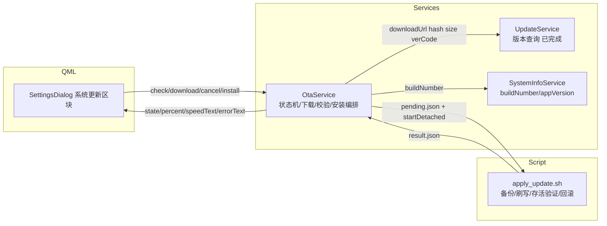
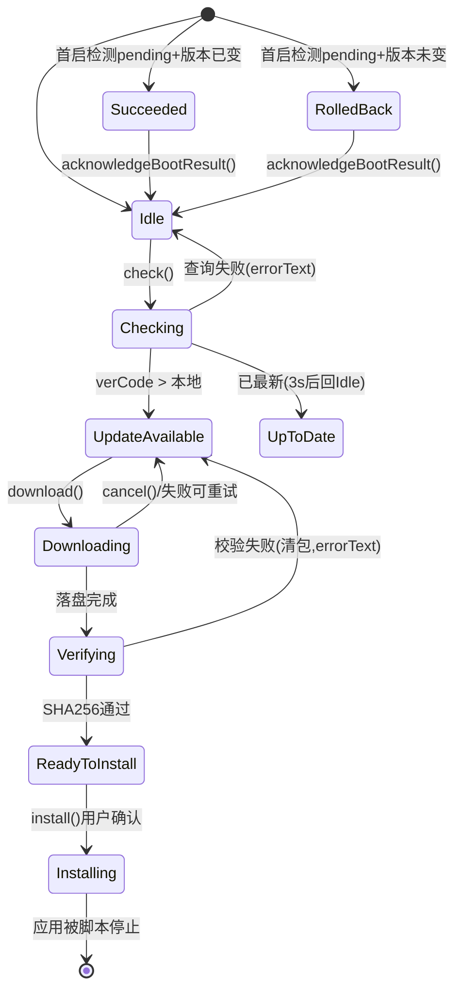

## User Requirements
为 SmartScale 电子秤应用制定并落地完整的远程升级（OTA）功能，今日内完成核心逻辑代码实现与初步自测。已确认范围：
- **触发方式**：仅应用内手动检查（SettingsDialog「系统更新」区块），不做 MQTT 远程命令、不做开机自动检查
- **进度上报**：仅 QML 进度接口（C++ Q_PROPERTY + 信号），不上报云端
- **自测边界**：完整真实演练（接受真实停应用、替换二进制、拉起、回滚全流程）

## Product Overview
在现有已完成的 `UpdateService`（版本查询）与 `make_update_package.sh`（打包）基础上，补齐设备端 OTA 闭环：版本比较 → 固件下载（流式落盘+进度）→ SHA256 校验 → 脚本化刷写（备份+存活验证+自动回滚）→ 首启结果确认。用户在设置弹窗中可查看新版本、观察下载进度条、确认安装；升级失败自动回滚并在下次启动时告知结果。

## Core Features
- 本地 verCode 暴露与新旧版本比较（BUILD_NUMBER 充当 verCode）
- OTA 状态机（Idle/Checking/UpdateAvailable/Downloading/Verifying/ReadyToInstall/Installing/结果态），Q_ENUM 暴露 QML
- 固件下载器：流式写入 `data/ota/`，进度/速度/取消/磁盘空间预检/看门狗超时
- SHA256 校验（增量计算，对照 UpdateService.hash），失败自动清包
- `scripts/apply_update.sh`：停应用 → .bak 备份 → 替换 → 拉起 → 30s 存活验证 → 失败自动回滚，退出码+result.json 回传
- 首启自检：pending.json/result.json 标记判定升级成功/已回滚，Toast 告知
- SettingsDialog「系统更新」区块：版本信息、状态文字、进度条、检查/下载/取消/安装按钮
- 今日开发时间表（见 todolist 与 tech 中的排期）


## Tech Stack Selection
- 复用现有栈：Qt6 (Quick/QML) + C++17，网络 Qt6::Network（QNetworkAccessManager），哈希 QCryptographicHash，进程 QProcess，磁盘 QStorageInfo，脚本 Bash
- 复用已有：`UpdateService`（查询）、`NetworkUtils::createUpdateApiRequest`（统一请求配置）、`SystemInfoService`（版本）、`scripts/make_update_package.sh`（打包产物 `smartscale-<ver>.tar.gz` = appSmartScale + manifest.json）
- 无新增第三方依赖

## Implementation Approach
**策略**：新增独立 `OtaService` 组合（而非塞入）`UpdateService`——UpdateService 保持纯查询单一职责，OtaService 持有其指针读取 downloadUrl/hash/size/fileName/verCode，自身负责状态机、下载、校验、安装编排、首启确认。这符合项目 services 层"一服务一职责"的既有模式（AuthService/NetworkManagerService 同构），也避免改动已验证的查询逻辑（blast radius 最小化）。

**关键决策与权衡**：
1. **主线程异步下载**：11MB 包用 QNetworkReply readyRead 流式写 `data/ota/<fileName>.part`，Qt 事件循环天然不卡 UI，无需 worker 线程（参考 VoiceSpeaker 才需要线程，因为它做 CPU 密集合成；下载是 I/O 密集）。完成时 rename 去 `.part`，中途取消/失败删 `.part`，空间复杂度 O(1) 额外内存。
2. **增量 SHA256**：readyRead 内 `QCryptographicHash::addData`，完成即得 hash，避免 11MB 二次读盘（约省 100ms+ 一次全文件 I/O）。
3. **verCode 比较**：`version.h.in` 增加 `APP_BUILD_NUMBER "@BUILD_NUMBER@"`，`SystemInfoService` 新增 `Q_PROPERTY(int buildNumber CONSTANT)`；`hasUpdate = UpdateService.verCode > SystemInfo.buildNumber`，同时尊重 `verCodeMin/Max` 区间。字符串版本仅用于显示。
4. **安装即自杀式**：Installing 态 C++ 写 `data/ota/pending.json`（targetVersion/verCode/hash/时间戳）后用 `QProcess::startDetached` 启动 apply_update.sh，脚本负责停本应用——因此 Installing 态不做进度上报（进程即将退出），结果通过首启自检闭环。
5. **首启确认**：OtaService 构造时检测 pending.json + result.json（脚本写 exitCode/message）+ 当前 buildNumber 比对：升级成功 → Succeeded 一次性 Toast；脚本回滚（buildNumber 仍为旧值）→ RolledBack 提示；随后清除标记回 Idle。
6. **权限策略**：脚本内 `systemctl` 操作需 root。设备应用运行用户待确认——脚本先探测（`systemctl list-units` 找 smartscale 服务 / `sudo -n` 可用性），失败返回专用退出码（如 12），QML 脱敏提示"无升级权限"。实施时先做一次 `ps -o user= -C appSmartScale` 确认。

**性能**：下载为唯一重 I/O 路径；速度用 500ms 滑动窗口计算避免高频 property 通知（限流 emit，progress 每 ≥1% 或 ≥500ms 才通知）；SHA256 增量计算 O(n) 单次遍历。**可靠性**：网络看门狗（30s 无数据判超时）、磁盘预检（可用空间 > size×2，含 .bak 冗余）、`.part` 文件崩溃残留下次启动清理。

## Implementation Notes
- **禁止 AI 执行 make/cmake**：改完用 `read_lints` 验证语法，编译由用户 `make -j1`
- **日志**：沿用 `qInfo/qWarning` + `[OtaService]` 前缀（同 `[UpdateService]`）；错误信号 message 必须脱敏（禁含 URL 内部细节/路径堆栈），QML 走 `window.alert()` 智能脱敏；进度日志限速（仅状态迁移 + 每 10% 一条）
- **data/ 保护**：下载目录固定 `applicationDirPath()/data/ota/`，apply_update.sh 绝不触碰 `data/smartscale.db` 与日志；`.bak` 只保留最近一份（防磁盘膨胀，设备存储有限）
- **兼容**：UpdateService 公共接口零改动；SettingsDialog 现有 L41-49/83-86 的 `updateVersionText` 逻辑迁移进新区块（删除旧只读行 L203 改为新区块），`onOpened` 的自动 checkUpdate 改为驱动 OtaService.check()
- **QML 规范**：颜色全部走 `Theme.qml` 常量；按钮/进度条样式参照既有 SettingRow/ToggleSwitch 卡片风格（`#F5F7FA` 圆角卡片、`#E2E8F0` 分隔线、24px 字、PingFang SC）；无 cursorShape；无自动聚焦
- **CMake**：新源文件按 L105-115 services 段格式追加进 `qt_add_qml_module` SOURCES

## Architecture Design
### 模块划分与关系


### OTA 状态机


## Directory Structure
```
SmartScale/
├── src/
│   ├── version.h.in                    # [MODIFY] 增加 APP_BUILD_NUMBER "@BUILD_NUMBER@" 宏（供 SystemInfoService 暴露数值 verCode）
│   ├── services/
│   │   ├── SystemInfoService.h/.cpp    # [MODIFY] 新增 Q_PROPERTY(int buildNumber READ buildNumber CONSTANT)，构造时从 APP_BUILD_NUMBER 宏 atoi 赋值；零行为变更风险
│   │   └── OtaService.h/.cpp           # [NEW] OTA 核心服务。enum State(Q_ENUM)：Idle/Checking/UpdateAvailable/UpToDate/Downloading/Verifying/ReadyToInstall/Installing/Succeeded/RolledBack；
│   │                                   #        Q_PROPERTY：state/hasUpdate/targetVersion/percent/bytesReceived/bytesTotal/speedText/errorText/force；
│   │                                   #        Q_INVOKABLE：check()/download()/cancel()/install()/acknowledgeBootResult()；
│   │                                   #        构造注入 UpdateService*+SystemInfoService*；内部：QNetworkAccessManager 流式下载到 data/ota/*.part（增量 SHA256）、
│   │                                   #        QStorageInfo 磁盘预检、30s 无数据看门狗、进度限速 emit、pending.json 写入+startDetached 调脚本、首启 pending/result 检测
│   ├── ui/components/
│   │   └── SettingsDialog.qml          # [MODIFY] L203 只读"版本更新"行替换为「系统更新」区块：当前/最新版本行、状态文字、双圆角进度条（percent 绑定）、
│   │                                   #        情境按钮（检查更新/下载/取消/立即安装），安装前复用 AlertDialog 确认；删除旧 updateVersionText 逻辑改为绑定 OtaService；
│   │                                   #        首启 bootResult 用 Toast 提示；样式遵循 Theme 常量与既有卡片规范
├── scripts/
│   └── apply_update.sh                 # [NEW] 设备端刷写脚本。入参 --package/--app-dir/--service/--dry-run；流程：解包到临时目录→停应用(systemctl stop 优先，pkill 兜底)→
│                                       #        cp appSmartScale{,.bak}→新二进制就位+chmod→写 result.json→拉起→30s 存活验证(进程在+alive 心跳)→失败恢复 .bak 再拉起；
│                                       #        退出码语义化(0成功/10参数/11权限/12停起失败/13存活验证失败已回滚)；支持 --dry-run 临时目录全模拟
├── app/main.cpp                        # [MODIFY] L244 附近创建 OtaService（注入 updateService/systemInfoService），L407-422 段注册 qmlRegisterSingletonInstance("App.Backend",1,0,"OtaService",...)
└── CMakeLists.txt                      # [MODIFY] services 段（L115 后）追加 SOURCES src/services/OtaService.h src/services/OtaService.cpp
```

## Key Code Structures
```cpp
// src/services/OtaService.h — 核心接口契约
class OtaService : public QObject {
    Q_OBJECT
    Q_PROPERTY(State    state         READ state        NOTIFY stateChanged)
    Q_PROPERTY(bool     hasUpdate     READ hasUpdate    NOTIFY stateChanged)
    Q_PROPERTY(QString  targetVersion READ targetVersion NOTIFY stateChanged)   // UpdateService.version
    Q_PROPERTY(int      percent       READ percent      NOTIFY progressChanged) // 0-100
    Q_PROPERTY(qint64   bytesReceived READ bytesReceived NOTIFY progressChanged)
    Q_PROPERTY(qint64   bytesTotal    READ bytesTotal   NOTIFY progressChanged)
    Q_PROPERTY(QString  speedText     READ speedText    NOTIFY progressChanged) // "1.2 MB/s"
    Q_PROPERTY(QString  errorText     READ errorText    NOTIFY stateChanged)    // 已脱敏
public:
    enum class State { Idle, Checking, UpdateAvailable, UpToDate, Downloading,
                       Verifying, ReadyToInstall, Installing, Succeeded, RolledBack };
    Q_ENUM(State)
    OtaService(UpdateService *upd, SystemInfoService *sys, QObject *parent = nullptr);
    Q_INVOKABLE void check();      // Idle/任意失败态 → Checking（委托 UpdateService.checkUpdate）
    Q_INVOKABLE void download();   // UpdateAvailable → Downloading
    Q_INVOKABLE void cancel();     // Downloading → UpdateAvailable（abort + 删 .part）
    Q_INVOKABLE void install();    // ReadyToInstall → Installing（写 pending.json + startDetached 脚本）
    Q_INVOKABLE void acknowledgeBootResult(); // Succeeded/RolledBack → Idle
Q_SIGNALS:
    void stateChanged();
    void progressChanged();
    void bootResult(bool success, const QString &message); // 首启一次性结果，QML Toast
};
```
```bash
# scripts/apply_update.sh — 接口契约
# 用法: apply_update.sh --package <tar.gz> --app-dir <dir> [--service <name>] [--dry-run]
# 退出码: 0=成功 10=参数错误 11=权限不足 12=停/起应用失败 13=存活验证失败(已自动回滚) 14=包损坏
# 副作用: 写 <app-dir>/data/ota/result.json {"exitCode":N,"message":"...","rolledBack":bool}
```

## 今日开发时间表（2026-07-29）
| 时段 | 内容 | 检查点 |
|---|---|---|
| 09:30–10:30 | version.h.in + SystemInfoService.buildNumber + OtaService 骨架（状态机/属性/空槽函数）+ CMake/main.cpp 注册 | read_lints 通过；QML 能读到 OtaService.state |
| 10:30–12:00 | 下载器：流式落盘 data/ota、进度/速度限速 emit、取消、磁盘预检、看门狗；本地 `python3 -m http.server` 挂包自测下载 | 下载 11MB 包 percent 0→100，cancel 后 .part 清除 |
| 13:00–14:00 | 增量 SHA256 校验 + UpdateService 组合接线（hasUpdate 比较 verCodeMin/Max）+ 用户 `make -j1` 首轮编译 | 篡改包触发校验失败分支；正确包进 ReadyToInstall |
| 14:00–15:30 | apply_update.sh（备份/替换/存活验证/回滚/退出码/result.json）+ `--dry-run` 临时目录自测（含故意损坏包演练回滚） | dry-run 下旧版可恢复、退出码正确 |
| 15:30–16:30 | SettingsDialog「系统更新」区块 UI + AlertDialog 安装确认 + 首启 Toast；read_lints 验证 | UI 各状态按钮/进度条显示正确 |
| 16:30–18:00 | 完整真实演练：make_update_package.sh 打 BUILD_NUMBER+1 测试包 → 本地 HTTP 挂包 → 设备端检查/下载/校验/安装 → 重启验证 appVersion 变更；再演练一次回滚路径 | 升级后版本号更新；回滚后 RolledBack 提示正确 |


## Agent Extensions
### Skill
- **karpathy-guidelines**
  - Purpose: 约束 OtaService 与 apply_update.sh 的实现保持外科手术式改动（不重构 UpdateService 等既有代码）、避免过度设计（v1 不做断点续传/差分包）、为每个状态迁移定义可验证的成功判据
  - Expected outcome: 改动仅限目录结构中列出的 8 个文件；每个 todo 完成时有明确验证点（read_lints/干跑退出码/版本号比对）
