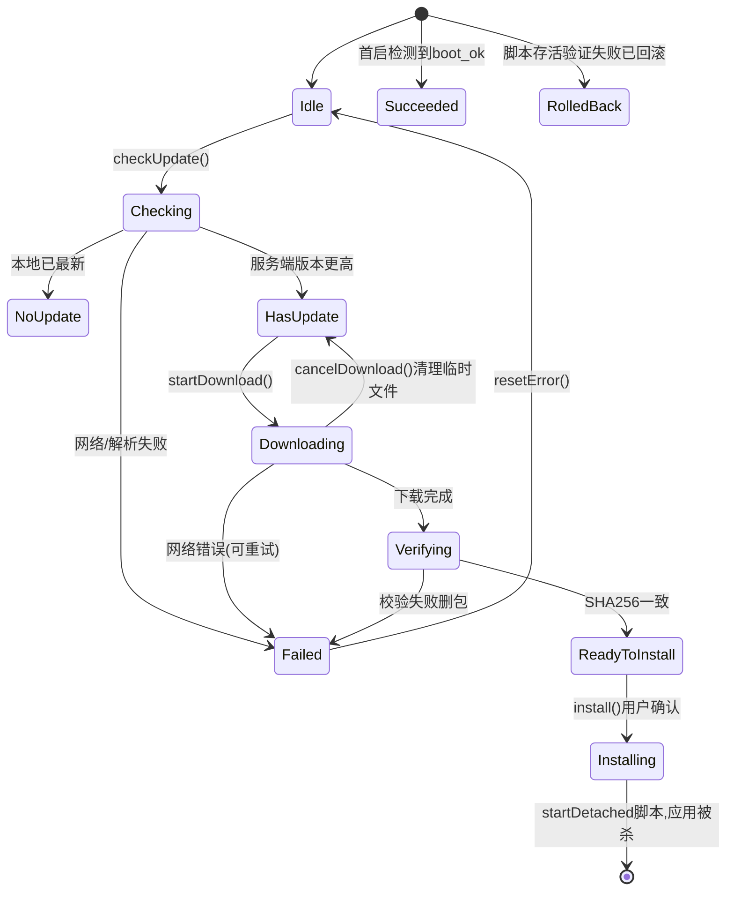

## 用户需求
为 SmartScale（Qt6/QML 嵌入式称重应用，aarch64 设备）实现应用级 OTA 远程升级。范围已确认：仅应用内手动检查触发（不做 MQTT 远程命令、不做开机自动检查）；进度上报仅为 QML 接口（不上报云端）；今日自测为完整真实演练（真实停应用、替换二进制、拉起、回滚验证）。

## 产品概述
在既有「设置弹窗 → 版本更新」基础上扩展为完整升级闭环：用户打开设置弹窗检查到新版本后，可一键下载升级包、自动校验、确认安装；安装脚本完成备份、刷写、存活验证，失败自动回滚旧版本；升级结果（成功/失败已回滚）在下次启动时以 Toast 告知用户。全程在弹窗内以进度条、速度、状态文字呈现。

## 核心功能
- 版本检查：复用 UpdateService 查询，与本地版本（主版本号+构建号）比较判定是否有新版本
- 固件下载：流式下载到本地临时目录，显示百分比/已下载量/速度，支持取消与失败清理
- 双重校验：下载包 SHA256 比对服务器 hash；刷写前脚本再比对包内 manifest 的二进制 sha256
- 刷写与回滚：apply_update.sh 完成停应用→备份 .bak→替换→拉起→存活验证，失败自动恢复旧版
- 状态机与进度接口：OtaService 以枚举状态+Q_PROPERTY（state/percent/speed/errorString 等）驱动 QML
- 升级结果反馈：首启自检 pending 标记，Toast 提示「升级成功」或「升级失败已回滚」
- 今日时间表：分时段完成编码与两条路径（成功/回滚）的真实演练


## 技术选型
- 语言/框架：沿用项目现有 Qt6 C++17 + QML（Quick Controls），脚本用 Bash
- 网络：QNetworkAccessManager（复用 NetworkUtils 统一 SSL/HTTP1.1 配置），readyRead 流式写盘
- 校验：QCryptographicHash(SHA256) 流式累加；脚本侧 sha256sum
- 刷写：QProcess::startDetached 拉起 scripts/apply_update.sh（安装会杀死本进程，必须 detach）
- 状态机：OtaService 内聚状态枚举，Q_ENUM 暴露 QML，单一写者 setState()

## 实现方案
### 总体策略
新增 `OtaService` 作为 OTA 唯一入口，**组合**而非修改 UpdateService（UpdateService 保持纯查询，其既有 QML 接口与 SettingsDialog 现状行为零回归）。OtaService 监听 UpdateService::checkFinished，取 version/downloadUrl/size/hash，与本地版本比较后驱动状态机。下载、校验、安装、首启自检全部收敛在 OtaService；刷写细节下沉到独立 bash 脚本，C++ 只负责发起与结果解读，职责清晰、可独立测试。

### 版本比较（关键决策）
服务端 verCode（如 325）与本地 BUILD_NUMBER（如 25）量纲不一致，**不能直接比较**。采用版本元组比较：解析 UpdateService.version（形如 "V2.13.3.26"）为 (major,minor,patch,build)，与本地 (APP_VERSION_MAJOR/MINOR/PATCH, buildNumber) 字典序比较，大则 HasUpdate。buildNumber 由 version.h.in 新增宏 APP_BUILD_NUMBER（BUILD_NUMBER 已是 CMake 变量，configure_file 直接可用）经 SystemInfoService 新 Q_PROPERTY 暴露。

### 状态机


### 异常处理与回滚
- 下载前 QStorageInfo 检查剩余空间大于 3 倍包大小，不足直接 Failed
- 下载写 data/ota/downloading.tmp，完成后 rename 为正式包；取消/失败一律删临时文件
- 校验失败删除包并提示重新下载；网络失败允许在原状态重试
- apply_update.sh 流程：参数/权限自检（非 root 自动 sudo -n 重入，失败退出码 4）→ tar -tzf 完整性检查 → 解到 data/ota/stage → manifest 二进制 sha256 复核 → 写 pending.json 标记 → systemctl stop smartscale（无 service 则 pkill）→ appSmartScale 备份为 .bak → 新版就位 chmod +x → 拉起应用 → 轮询等待 data/ota/boot_ok 标记最长 60 秒 → 出现则退出 0；超时则恢复 .bak、拉起旧版、写 result.json(rolledback)、退出 5
- boot_ok 由新进程启动后（main.cpp engine 加载成功）经 OtaService::notifyBootCompleted() 写入，同时解读 pending.json 发 updateSucceeded/updateFailed 信号，QML Toast 展示
- data/ 目录只新增 ota/ 子目录，用户库 smartscale.db 绝不触碰

### 性能与可靠性
- 11MB 包 readyRead 流式写盘，内存常驻低于 64KB 缓冲；SHA256 同流累加，避免二次读盘（校验阶段再读一次全量用于独立复核，11MB 读盘耗时可忽略）
- 速度按 1 秒窗口平滑，避免 UI 高频刷新（progressChanged 节流至 200ms）
- 主线程事件循环异步下载即可，不引入额外线程；Qt 信号异步不会卡 UI

### 实施注意
- 禁止 AI 执行 make，改完用 read_lints 验证；编译由用户跑 make -j1
- 错误信息 emit 前脱敏，不带 URL/路径等技术细节给 QML 展示层（日志可详细）
- updateId 等云端 ID 保持 QString，严禁 toInt()
- QML 遵循既有规范：Theme 常量、弹窗 modal+Overlay 遮罩、无 cursorShape、居中 y 公式
- 爆炸半径控制：UpdateService/SettingsDialog 既有行为保留；新 UI 独立成 OtaUpdateDialog 组件，SettingsDialog 仅加一行入口与状态绑定

## 架构设计
模块关系：SettingsDialog/OtaUpdateDialog（QML）→ OtaService（状态机+下载+校验+安装发起+首启自检）→ 持有 UpdateService（纯查询）与 SystemInfoService（buildNumber）→ apply_update.sh（刷写/回滚）→ 文件标记 data/ota/{pending.json,boot_ok,result.json} 跨进程传递结果。

## 目录结构
```
SmartScale/
├── src/
│   ├── version.h.in                      # [MODIFY] 新增 APP_BUILD_NUMBER 宏（值为 CMake BUILD_NUMBER）
│   ├── services/
│   │   ├── SystemInfoService.h/.cpp      # [MODIFY] 新增 Q_PROPERTY buildNumber(int CONSTANT)，读取 APP_BUILD_NUMBER
│   │   ├── OtaService.h                  # [NEW] OTA 状态机定义、Q_PROPERTY/信号/Q_INVOKABLE 接口
│   │   └── OtaService.cpp                # [NEW] 版本比较、流式下载、SHA256 校验、startDetached 调脚本、首启自检
│   └── ui/components/
│       ├── SettingsDialog.qml            # [MODIFY] 「版本更新」行扩展：新版本提示+下载/检查按钮，打开 OtaUpdateDialog
│       └── OtaUpdateDialog.qml           # [NEW] 升级弹窗：版本信息、进度条、速度、取消/安装按钮、失败重试、安装中提示
├── src/ui/Main.qml                       # [MODIFY] Connections 监听 updateSucceeded/updateFailed 弹 Toast；启动后调 notifyBootCompleted
├── app/main.cpp                          # [MODIFY] 创建 OtaService（注入 updateService/systemInfo）、注册 QML singleton、engine 加载成功后触发首启自检
├── CMakeLists.txt                        # [MODIFY] QML_FILES 加 OtaUpdateDialog.qml；SOURCES 加 OtaService.h/.cpp
└── scripts/
    └── apply_update.sh                   # [NEW] 刷写脚本：备份/校验/替换/存活验证/自动回滚，语义化退出码
```

## 关键代码结构
```cpp
// src/services/OtaService.h — 接口契约
class OtaService : public QObject
{
    Q_OBJECT
    Q_PROPERTY(int state READ state NOTIFY stateChanged)
    Q_PROPERTY(bool busy READ busy NOTIFY stateChanged)
    Q_PROPERTY(bool updateAvailable READ updateAvailable NOTIFY updateAvailableChanged)
    Q_PROPERTY(QString targetVersion READ targetVersion NOTIFY updateAvailableChanged)
    Q_PROPERTY(qint64 targetSize READ targetSize NOTIFY updateAvailableChanged)
    Q_PROPERTY(int percent READ percent NOTIFY progressChanged)
    Q_PROPERTY(double speedKBps READ speedKBps NOTIFY progressChanged)
    Q_PROPERTY(QString errorString READ errorString NOTIFY errorChanged)

public:
    enum State { Idle, Checking, NoUpdate, HasUpdate, Downloading,
                 Verifying, ReadyToInstall, Installing, Succeeded, Failed, RolledBack };
    Q_ENUM(State)

    explicit OtaService(UpdateService *updateService, SystemInfoService *sysInfo, QObject *parent = nullptr);

    Q_INVOKABLE void checkUpdate();                        // 委托 UpdateService 后自动比较版本
    Q_INVOKABLE void startDownload();
    Q_INVOKABLE void cancelDownload();
    Q_INVOKABLE void install();                            // 用户确认后 detach 执行 apply_update.sh
    Q_INVOKABLE void installFromLocalFile(const QString &path); // 本地包安装（今日演练与兜底通道）
    Q_INVOKABLE void resetError();
    void notifyBootCompleted();                            // main.cpp 启动后调用：写 boot_ok + 解读 pending

Q_SIGNALS:
    void stateChanged();
    void updateAvailableChanged();
    void progressChanged();
    void errorChanged();
    void updateSucceeded(const QString &version);
    void updateFailed(const QString &reason);
};
```

apply_update.sh 退出码契约：0=成功；2=包损坏；3=包内校验失败；4=权限不足；5=存活验证失败已回滚。

## 今日开发时间表（2026-07-29）
| 时段 | 内容 | 产出/检查点 |
|---|---|---|
| 09:00-09:40 | version.h.in 加 APP_BUILD_NUMBER；SystemInfoService 暴露 buildNumber | read_lints 通过 |
| 09:40-11:30 | OtaService：状态机+版本比较+流式下载+SHA256 校验 | read_lints 通过 |
| 11:30-12:00 | 下载冒烟：本地 python3 -m http.server 挂包，installFromLocalFile/调试入口验证下载与校验 | 临时文件生成、hash 一致 |
| 13:00-14:00 | 编写 apply_update.sh，先在临时目录用假二进制干跑验证备份/回滚分支 | 脚本各退出码符合契约 |
| 14:00-15:00 | CMakeLists 注册、main.cpp 接线、OtaUpdateDialog 与 SettingsDialog UI | read_lints 通过 |
| 15:00-15:30 | 用户执行 make -j1，修复编译问题 | 二进制产出 |
| 15:30-16:30 | 成功路径演练：BUILD_NUMBER+1 打包 → installFromLocalFile → 真实刷写 → 新版本启动 Toast「升级成功」 | 版本号变为新版 |
| 16:30-17:15 | 回滚路径演练：构造损坏包/无法启动二进制 → 存活验证超时 → 自动恢复 .bak → Toast「升级失败已回滚」 | 旧版本完整可用 |
| 17:15-17:45 | 收尾清理临时文件、补充日志、更新项目记忆文档 | 演练记录归档 |


## Agent Extensions
### Skill
- **id-type-safety**
  - 用途：OTA 流程中云端 updateId 等 ID 字段的解析与传递审查，防止 toInt() 溢出
  - 预期结果：所有 ID 字段保持 QString/qint64，无数值截断风险
- **karpathy-guidelines**
  - 用途：实现 OtaService 与脚本时约束改动范围、暴露假设、定义可验证成功标准
  - 预期结果：改动外科手术化，不波及 UpdateService 既有行为与其他服务
