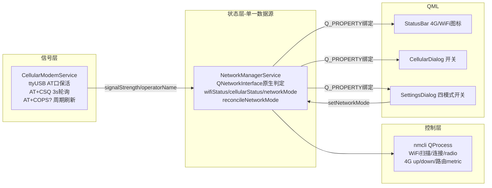

## 用户需求
按照用户给出的方案表重构网络状态管理模块：WiFi/4G 联网判定改用 `QNetworkInterface` 原生 C++（毫秒级），WiFi 信号读 `/proc/net/wireless`（现状保留），4G 信号用 QSerialPort 发 `AT+CSQ`。同时要求重构后的网络状态与 SettingsDialog 的配置项（四个网络模式开关）保持双向联动：配置修改自动下发到网络设备；网络状态变更（含外部变更）准确反映到 SettingsDialog 显示；消除状态不一致与数据冲突，逻辑清晰可维护。

## 产品概述
SmartScale 嵌入式称重设备的网络管理子系统重构。重构后状态栏图标、4G 弹窗、设置弹窗三处 UI 全部以"真实连接状态"为唯一数据源：真断网时状态栏 4G 图标立即显示 Signal0；设置弹窗四个模式开关高亮始终与实际网络状态一致；4G 信号格数来自 AT+CSQ 真实 RSSI 而非固定假值 65。

## 核心功能
- WiFi 联网判定：`QNetworkInterface::interfaceFromName(wlan0)` 判 IsUp/IsRunning + 全局 IPv4（已确认用户决策，替代 nmcli 状态解析）
- 4G 联网判定：`QNetworkInterface::interfaceFromName(eth1)` 是否有 IPv4 地址（替代 mmcli/nmcli/ip 三套查询）
- 4G 信号强度：扩展已存在的 CellularModemService（ASR ML307B AT 状态机），AT 口保活后周期发 `AT+CSQ`，RSSI 0-31 映射 0-100（HTTP API 路线已探测不通，用户确认走串口）
- 状态语义统一：移除 cellularUiActive 意图层，StatusBar/CellularDialog/SettingsDialog 全部读真实 cellularStatus（用户已确认）
- mmcli（ModemManager）路径彻底移除（本机 RNDIS 模式死代码，用户已确认）；控制层（WiFi 扫描/连接/radio、4G 开关、路由 metric）保留 nmcli
- SettingsDialog 双向联动：NetworkManager.networkMode 作为 C++ 侧单一数据源，网络状态变化时 C++ 自动 reconcile 模式并通知 QML 高亮；开关点击经 setNetworkMode 下发设备


## 技术栈
- 沿用现有栈：Qt6 C++（QNetworkInterface / QSerialPort / QProcess）+ QML，无新增依赖（`Qt6::Network`、`Qt6::SerialPort` 已在 CMakeLists 第 40/161/162 行链接）
- 复用现有组件：`CellularModemService`（已有 ttyUSB* AT 口自动探测状态机、ASR ML307B 115200 8N1、AT+COPS? 运营商中文化）、`runOnMainThread` 线程投递、`AppSettings.networkMode` 持久化

## 实现方案
**核心策略**：检测层原生同步化、信号层串口保活轮询、状态层单一数据源。

1. **检测层（NetworkManagerService）**：`refreshWifiStatus`/`refreshCellularStatus` 的"联网与否"判定改为 `QNetworkInterface::interfaceFromName(dev)`：接口存在且 `IsUp|IsRunning` 且 `addressEntries()` 含非 link-local 的 IPv4 → Connected；接口在但无 IP → Disconnected（WiFi）/CellDisabled（4G）；接口不存在 → Disabled（WiFi，radio off 时 wlan0 消失）/hasCellularHardware=false（4G）。该调用在 Linux 上走 getifaddrs，微秒级、无外部进程。SSID/连接名等"富化信息"仍走短 nmcli 查询（保留 QtConcurrent 工作线程 + runOnMainThread 模式，避免阻塞 UI）。为防 DHCP 续租瞬间丢 IP 导致图标闪断，仅对"Connected→断开"方向保留 2 次连续无 IP 才落断的轻量去抖（约 6s）；反向立即生效。
2. **信号层（CellularModemService）**：现有状态机到达 Done 后不再关闭串口，改为保活并启动 CSQ 轮询定时器（3s，与 NetworkManager 轮询同频），顺序发 `AT+CSQ\r` 解析 `+CSQ: rssi,ber`（rssi 0-31 → `rssi*100/31`，99=未知保持上次），新增 `signalStrength`(0-100) 属性 + `signalStrengthChanged` 信号；每 10 个周期顺带刷新一次 AT+COPS? 运营商；串口 errorOccurred/打不开 → available=false、信号归 0、走既有 retry 机制重新探测。只探测 /dev/ttyUSB*，与称重串口（ttyS 系列）无冲突。
3. **状态整合（NetworkManagerService）**：main.cpp 第 242 行后注入 `networkManagerService->setCellularModem(cellularModemService)`（沿用 setVoiceSpeaker 注入模式），连接 modem 的 signalStrengthChanged/operatorNameChanged 镜像到 m_cellularSignal/m_cellularOperator（运营商优先 AT 真实值，兜底 nmcli 连接名）。modem 不可用时信号归 0 但不影响联网判定（解耦）。
4. **删除清单**：mmcli 全套（hasModemManager/discoverModemIndex/updateCellularStatusFromMmcli/enable|disableCellularViaModem/m_mmcliPath/kMmcliPaths）、快速路径（refreshCellularStatusFast/findCellularInterfaceFast/scheduleFastCellularRefresh/m_fastExpectEnable，被原生检测取代）、m_cellLostStreak/kCellLostThreshold 旧去抖、cellularUiActive 属性+信号+成员+全部同步逻辑（setCellularStatus 内意图回写、enableCellular 点击置位、update* 内 Unknown 保留逻辑）。4G 开关后的过渡期仍用 CellSearching + 单次 singleShot 立即刷新表达。
5. **networkMode 单一数据源**：C++ 新增 `reconcileNetworkMode()`，在 wifi/cellular 状态落定（跳过 Searching 过渡态防抖）时按现 QML refreshNetMode 同语义推导模式（wifiOn=Connected|Connecting；cellOn=Searching..Roaming；都开→保留优先级偏好；都关→AllCellularPriority），变更时更新 m_networkMode 并 emit networkModeChanged。SettingsDialog 删除本地推断，高亮直绑 `NetworkManager.networkMode`， Connections 只留 onNetworkModeChanged→syncSwitches()；setNetMode 仍写 AppSettings + 调 setNetworkMode（需求 1 下发链路不变）。

## 实现注意
- **性能**：原生检测为微秒级同步调用，3s 轮询 CPU 占用显著低于现状（每轮少 2-4 个 QProcess）；CSQ 轮询复用已打开的串口，每条命令 <10ms。去抖只在状态翻转方向生效，正常轮询零开销。
- **日志**：沿用 qDebug/qInfo/qWarning 现有分级；AT 收发只记解析结果不记原始字节流；状态翻转必记（便于排查"闪断网"回归）。
- **影响面控制**：QML 属性契约只减不增（删 cellularUiActive），Q_INVOKABLE 控制接口签名全保留；CellularDialog 的 uiSimOn 已是真实状态判定基本不动；m_disconnectTime 防回退窗口保留。
- **编译约束**：禁止自行 make，改完 read_lints 验证。

## 架构设计


## 目录结构
```
SmartScale/
├── src/services/
│   ├── CellularModemService.h      # [MODIFY] 新增 signalStrength 属性+信号；State 增 Polling 态；串口保活与 CSQ/COPS 周期调度声明
│   ├── CellularModemService.cpp    # [MODIFY] Done 后不 cleanupSerial 改保活；新增 CSQ 轮询定时器、+CSQ 解析(rssi*100/31)、串口错误重探测；复用既有超时/重试常量风格
│   ├── NetworkManagerService.h     # [MODIFY] 删 cellularUiActive/mmcli/快速路径/旧去抖声明；新增 setCellularModem() 注入、reconcileNetworkMode()、轻量无IP去抖成员；更新类注释（技术方案改为 QNetworkInterface+AT）
│   └── NetworkManagerService.cpp   # [MODIFY] refreshWifiStatus/refreshCellularStatus 改 QNetworkInterface 判定（保留 nmcli 富化信息与 QtConcurrent 模式）；删 mmcli 全部实现；接 modem 信号/运营商镜像；reconcileNetworkMode 在状态落定时推导模式
├── app/
│   └── main.cpp                    # [MODIFY] 第242行后加一行注入 networkManagerService->setCellularModem(cellularModemService)
└── src/ui/components/
    ├── SettingsDialog.qml          # [MODIFY] 删 refreshNetMode 本地推断与 onCellularUiActiveChanged；netMode 直绑 NetworkManager.networkMode；Connections 只留 onNetworkModeChanged→syncSwitches()
    ├── StatusBar.qml               # [MODIFY] 152-154行 4G 图标改 isCellularActive()?SignalN:Signal0；169-171行闪动反馈改挂 onCellularStatusChanged
    └── CellularDialog.qml          # [MODIFY] 清理 cellularUiActive 相关注释引用（41/355行注释），逻辑基本不变
```

## 关键代码结构
```cpp
// CellularModemService.h 新增
Q_PROPERTY(int signalStrength READ signalStrength NOTIFY signalStrengthChanged)
int signalStrength() const { return m_signalStrength; }
Q_SIGNALS: void signalStrengthChanged(int percent);
// 内部：m_csqTimer(3s) → 发 "AT+CSQ\r"；解析 +CSQ: rssi,ber → rssi∈[0,31] ? rssi*100/31 : 保持上次

// NetworkManagerService.h 新增/变更
void setCellularModem(CellularModemService *modem);   // main.cpp 注入，镜像信号/运营商
void reconcileNetworkMode();                          // 状态落定时推导四模式，emit networkModeChanged
int  m_cellNoIpStreak = 0;                            // Connected→断开方向 2 次无IP去抖（防DHCP续租闪断）
// 删除：cellularUiActive 属性/信号/成员、m_mmcliPath、m_cellLostStreak、m_fastExpectEnable 及对应方法
```


## Agent Extensions
### Skill
- **karpathy-guidelines**
  - Purpose: 指导 NetworkManagerService 的外科手术式重构——只动检测/信号层与状态语义，不波及 WiFi 连接流程、路由优先级等无关逻辑；删除死代码时保持接口契约稳定
  - Expected outcome: 重构改动面可控、无过度设计，每个假设（如去抖方向、Searching 过渡）在代码注释中显式标注，验收标准可逐条核对

## 验收标准
1. **WiFi 真实状态**：断开/连接 WiFi 后 3s 内（一个轮询周期）StatusBar WiFi 图标与 SettingsDialog 显示同步变化；状态判定不再产生 nmcli QProcess（可用日志确认每轮 0 个状态查询进程）。
2. **4G 真实状态**：执行 4G 关闭（或拔出 SIM/断电模块）后，StatusBar 4G 图标变 Signal0、CellularDialog 开关同步关；重新开启拿到 IP 后图标恢复对应信号格。
3. **双向联动（下发）**：SettingsDialog 点击任一模式开关 → NetworkManager.setNetworkMode 执行（wifi radio/4G 连接/route metric 实际切换），四开关互斥高亮立即正确。
4. **双向联动（回显）**：在系统层外部变更网络（如 nmcli 手动断 WiFi、关 4G）→ C++ reconcileNetworkMode 更新 networkMode 并 emit → 已打开的 SettingsDialog 高亮随之变化；重新打开时显示与真实状态一致。
5. **AT+CSQ 信号**：4G 已连接时 cellularSignal 为真实 RSSI 映射值（0-100，非固定假值）；AT 串口不可用/模块无响应时信号归 0 但不影响联网判定、不误判断网，恢复后自动重探测。
6. **回归**：WiFi 扫描/连接/断开、四模式路由优先级切换、WiFi 防回退窗口（断开后 5s 内不闪回 Connected）行为与重构前一致；read_lints 全部改动文件无错误。

## 风险与降级
- **CSQ 轮询与 CCID 查询争口**：CellularModemService 保活串口后，ICCID/COPS 查询与 CSQ 轮询共用同一 QSerialPort，须在状态机内串行调度（CSQ 定时器在 Querying* 态跳过当次），避免交错发 AT 导致解析错乱。
- **DHCP 续租闪断**：原生检测对"Connected→无IP"方向保留 2 次连续无 IP 去抖（约 6s），防止续租瞬间丢 IP 造成图标闪断网；断开方向立即生效。
- **搜网过渡态**：4G 开启命令发出到拿到 IP 之间用 CellSearching 表达（pending 标志 + singleShot 立即刷新），避免 UI 在过渡期显示断网。
- **mmcli 删除影响面**：仅检测路径删除；控制路径 enable/disableCellular 走 nmcli 设备模式（"有线连接 1"），本机实测链路不变。
