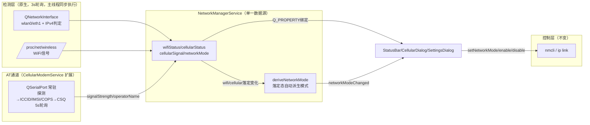

## 用户原始需求
按用户给出的方案图重构网络状态管理模块，并确保重构后的网络状态与 SettingsDialog 中的配置项（仅WIFI / 仅4G / 全开优先WIFI / 全开优先4G 四个互斥开关）保持双向联动：
1. SettingsDialog 配置修改 → 网络状态自动同步更新（WiFi 射频、4G 连接、路由优先级随之切换）
2. 网络状态变更（含外部途径：CellularDialog 开关 4G、系统层断网、拔插 4G 网棒）→ SettingsDialog 高亮准确跟随
3. 消除状态不一致/数据冲突，状态管理逻辑单一数据源、清晰可维护

## 方案图要求（检测层技术路线）
- WiFi 是否联网：QNetworkInterface 原生读取 wlan0（毫秒级，无外部进程）
- WiFi 信号强度：解析 /proc/net/wireless（低 CPU）
- 4G 是否联网：QNetworkInterface 原生读取 eth1 是否有 IPv4 地址
- 4G 信号强度：QSerialPort 发 AT+CSQ 获取蜂窝 RSSI

## 用户已确认的三项决策
1. 4G 信号源采用 AT+CSQ 串口（网棒 HTTP 管理页 192.168.0.1 各端口探测均无响应，HTTP API 路线放弃）
2. 状态语义统一为真实状态：移除 cellularUiActive 意图层，StatusBar 4G 图标、CellularDialog 开关、SettingsDialog 模式高亮全部以真实连接状态为唯一数据源；真断网时状态栏图标立即显示断网
3. mmcli（ModemManager）检测路径彻底移除（本机 4G 为 RNDIS 网棒 eth1，mmcli 是死代码）；控制层仍保留 nmcli（WiFi 扫描/连接/射频、4G ip link up/down、路由 metric）

## 核心功能
- 原生检测：WiFi/4G 联网判定与 IP 读取全部走 QNetworkInterface + /proc，轮询零外部进程
- AT 通道：CellularModemService 命中 AT 口后常驻打开，周期发 AT+CSQ 输出 0-100 信号强度
- 单一数据源：C++ NetworkManagerService 持有 networkMode 唯一真相；SettingsDialog 纯绑定展示
- 双向联动：点模式开关 → 下发硬件；真实状态落定变化 → C++ 自动派生有效模式 → 高亮与持久化同步
- 优雅降级：串口不可用时 4G 信号为 0 但不误判断网；4G 网棒拔出立即显示断网与无硬件


## Tech Stack
- Qt6 (Quick/QML) + C++17，沿用项目现有栈；Qt6::Network（QNetworkInterface）、Qt6::SerialPort 均已在 CMakeLists.txt（第40/162行）链接，无新增依赖
- 检测层：QNetworkInterface + /proc/net/wireless + /sys/class/net（原生，毫秒级）
- 控制层（不变）：nmcli（WiFi 扫描/连接/射频/路由 metric）+ sudo ip link set（4G up/down）
- AT 通道：QSerialPort 115200 8N1，复用 CellularModemService 现有 ttyUSB* 探测状态机

## 现状关键事实（已验证）
- 本机即目标板：eth1=rndis_host（4G 网棒，NM 连接"有线连接 1"）、eth0=macb（有线，排除项）、wlan0=WiFi；ttyUSB0/1/2（option1 驱动，ASR ML307B，AT 口动态探测，环境变量 SMARTSCALE_MODEM_PORT 可强制指定）
- CellularModemService 已实现：端口探测（发 AT 等 OK）→ AT+ICCID → AT+CIMI → AT+COPS? → finishWithAll() 关闭端口；含运营商中文化 normalizeOperatorName()
- WiFi 信号已是 /proc/net/wireless 解析（cpp 869-889行），保留
- SettingsDialog.qml：34-115行含本地 netMode 推导 refreshNetMode()（读 cellularUiActive+cellularStatus+wifiStatus），是双数据源冲突根源
- StatusBar.qml：148-172行 4G 图标与闪动动画绑 cellularUiActive；346-349行 isCellularActive()=Connected/Roaming
- CellularDialog.qml：已是真实状态驱动（uiSimOn = cellularStatus∈[Searching,Roaming]），仅 355 行注释提及 cellularUiActive
- main.cpp：212-236行开机恢复（networkMode≥0 延迟5s setNetworkMode；否则 cellularEnabled 记忆 3s 恢复），371-380行已有 modem 服务启动接线

## 架构设计


### 检测层重构（NetworkManagerService.cpp）
- `refreshWifiStatus()` 重写：`discoverWifiDevice()` 改原生（遍历 QNetworkInterface::allInterfaces()，匹配 wlan*/wlp*/mlan* 或 /sys/class/net/X/wireless 存在）→ `interfaceFromName()` 判定：接口缺失或 !IsUp → Disabled；IsUp 且有全局 IPv4（排除 link-local 169.254/环回）→ Connected 并取 IP；IsUp 无 IP → Disconnected（连接进行窗口内 → Connecting）。信号仍读 /proc/net/wireless。SSID 仅在 Connected 且 SSID 缓存为空时用一次 nmcli 反查（稳态零进程）。m_disconnectTime 防回退窗口删除（原生检测无 nmcli 缓存陈旧问题）
- `refreshCellularStatus()` 重写：`discoverCellularDevice()` 改原生（allInterfaces 匹配 eth1/usb0/wwan0/ppp0/enx*，排除 lo/eth0/wifi）→ 接口不存在 → hasCellularHardware=false + CellDisabled（内核事实，无需 m_cellLostStreak 去抖）；存在且有全局 IPv4 → CellConnected；存在无 IPv4 → 开启挂起窗口内保持 CellSearching（enable 后 30s 超时转 CellError），否则 CellDisabled
- 删除：mmcli 全家（kMmcliPaths/m_mmcliPath/hasModemManager/discoverModemIndex/enableCellularViaModem/disableCellularViaModem/updateCellularStatusFromMmcli/updateCellularStatusFromNmcli/signalQualityToPercent）、快速路径（refreshCellularStatusFast/findCellularInterfaceFast/scheduleFastCellularRefresh/m_fastExpectEnable）、m_cellLostStreak/kCellLostThreshold、cellularUiActive（属性/信号/成员/setCellularStatus 内同步逻辑）
- 轮询：`onStatusPollTimer()` 直接主线程同步调用两个 refresh（原生检测微秒级），移除 QtConcurrent::run；3s 间隔不变
- 保留：全部控制路径（enable/disableCellularViaDevice、setWifiEnabled、connect/disconnectWifi、scan、路由 metric）

### AT+CSQ 扩展（CellularModemService）
- 新增 `Q_PROPERTY(int signalStrength)` + `signalStrengthChanged` 信号；新增 State::PollingCsq
- `finishWithAll()` 后不再关闭串口：保留 m_serial，启动 5s 定时器循环发 `AT+CSQ\r`；`onReadyRead` 解析 `+CSQ: rssi,ber`：rssi∈[0,31] → percent=rssi*100/31；99=未知保持上次；值变化才发信号
- 串口 errorOccurred/连续无响应 → cleanupSerial + 走既有 fail()/重试状态机（信号归 0，不影响联网判定）
- 与称重串口无冲突（候选仅 ttyUSB*/ttyACM*/ASR VID 0x2ECC）

### 双向联动设计（核心）
单一写者原则：m_networkMode 仅由 C++ 两处写入——(a) setNetworkMode()（用户意图下发）；(b) `deriveNetworkModeFromState()`（新增私有方法，在 setWifiStatus/setCellularStatus 落定态 Connected/Disconnected/Disabled、CellConnected/CellDisabled 变化时调用；过渡态 Searching/Connecting 跳过防抖）。
派生规则（与现 QML 逻辑一致）：wifiOn=wifiStatus∈{Disconnected,Connecting,Connected}（射频开）；cellOn=cellularStatus∈{Searching,Registered,Connected,Roaming}；双关→AllCellularPriority；仅WiFi→WifiOnly；仅4G→CellularOnly；双开→保留当前 All* 偏好。仅在结果变化时更新 m_networkMode 并发 networkModeChanged（防信号风暴/循环）。
新增 public slot：`setCellularSignal(int)`、`setCellularOperator(QString)`（main.cpp 接线用，值变才 emit cellularStatusChanged）。

### QML 侧
- SettingsDialog.qml：删除 refreshNetMode() 及本地 netMode 推导；syncSwitches() 直接读 NetworkManager.networkMode（-1 时按 AllCellularPriority 显示）；setNetMode 只调 NetworkManager.setNetworkMode(m)（C++ 发信号回来同步高亮）；Connections 精简为仅 onNetworkModeChanged → syncSwitches + AppSettings.networkMode 持久化（双向闭环：外部变更→C++派生→信号→高亮+落盘）
- StatusBar.qml：4G 图标 source 改真实态（isCellularActive() ? Signal+level(cellularSignal) : Signal0.png）；闪动动画触发由 onCellularUiActiveChanged 改为 active 态跳变时 restart
- CellularDialog.qml：逻辑已符合，仅清理 355 行 cellularUiActive 过时注释
- main.cpp：新增两条 connect（CellularModemService::signalStrengthChanged/operatorNameChanged → NetworkManagerService 对应 slot）；开机恢复逻辑不变

## 性能与可靠性
- 稳态每 3s 轮询：2 次 QNetworkInterface 调用 + 1 次小文件读取，零 QProcess，CPU 占用可忽略；对比现状每次轮询 2-4 个 nmcli/mmcli 进程
- AT+CSQ 5s 一次，单命令往返 <50ms；串口故障降级为信号 0，不误判断网（联网判定只看 eth1 IPv4）
- 防回归：connected 判定排除 link-local；4G 判定不受 LOWER_UP 载波干扰（直接看 IPv4 而非 flags）

## 目录结构（全部修改，无新增文件）
```
SmartScale/
├── src/services/
│   ├── NetworkManagerService.h    # [MODIFY] 删 cellularUiActive/mmcli/快速路径声明；新增 setCellularSignal/setCellularOperator slot、deriveNetworkModeFromState()、原生发现与 hasGlobalIPv4 辅助声明；删 m_cellLostStreak/m_fastExpectEnable/m_disconnectTime/m_mmcliPath 成员
│   ├── NetworkManagerService.cpp  # [MODIFY] 核心重构：refreshWifiStatus/refreshCellularStatus 改 QNetworkInterface 原生实现；删 mmcli 与快速路径全部函数（约 600 行死代码）；轮询去 QtConcurrent；setNetworkMode 不变；落定态派生 networkMode
│   ├── CellularModemService.h     # [MODIFY] 新增 signalStrength 属性/信号、State::PollingCsq、m_csqTimer 成员
│   └── CellularModemService.cpp   # [MODIFY] finishWithAll 后保留串口进入 CSQ 轮询；解析 +CSQ 响应；串口错误接入既有重试机
├── app/
│   └── main.cpp                   # [MODIFY] 接线 modem signalStrength/operatorName → NetworkManager 两个 slot（约 +6 行）
└── src/ui/components/
    ├── SettingsDialog.qml         # [MODIFY] 删 refreshNetMode 本地推导（34-115行区）；高亮/持久化全部绑 NetworkManager.networkMode，实现双向联动
    ├── StatusBar.qml              # [MODIFY] 4G 图标（148-172行）改真实状态驱动；闪动动画触发条件同步调整
    └── CellularDialog.qml         # [MODIFY] 仅清理 355 行过时注释（行为已是真实状态）
```

## 实施注意
- 编译约束：禁止 AI 跑 make/cmake；改完用 read_lints 验证，用户自跑 make -j1
- 爆炸半径：QML 公开的属性/枚举/信号全部保持同名同语义（仅删 cellularUiActive），SettingsPage.qml、Main.qml、WifiListDialog.qml 等消费方零改动
- 验证后需更新记忆：cellularUiActive 移除、mmcli 移除、检测原生化、CSQ 信号源等长期事实


## Agent Extensions
### Skill
- **karpathy-guidelines**
  - Purpose: 约束重构过程遵循外科手术式最小改动、不过度设计、明确可验证成功标准
  - Expected outcome: NetworkManagerService 死代码删除与检测层重写保持接口面稳定，QML 消费方零意外破坏
